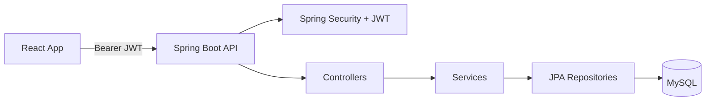
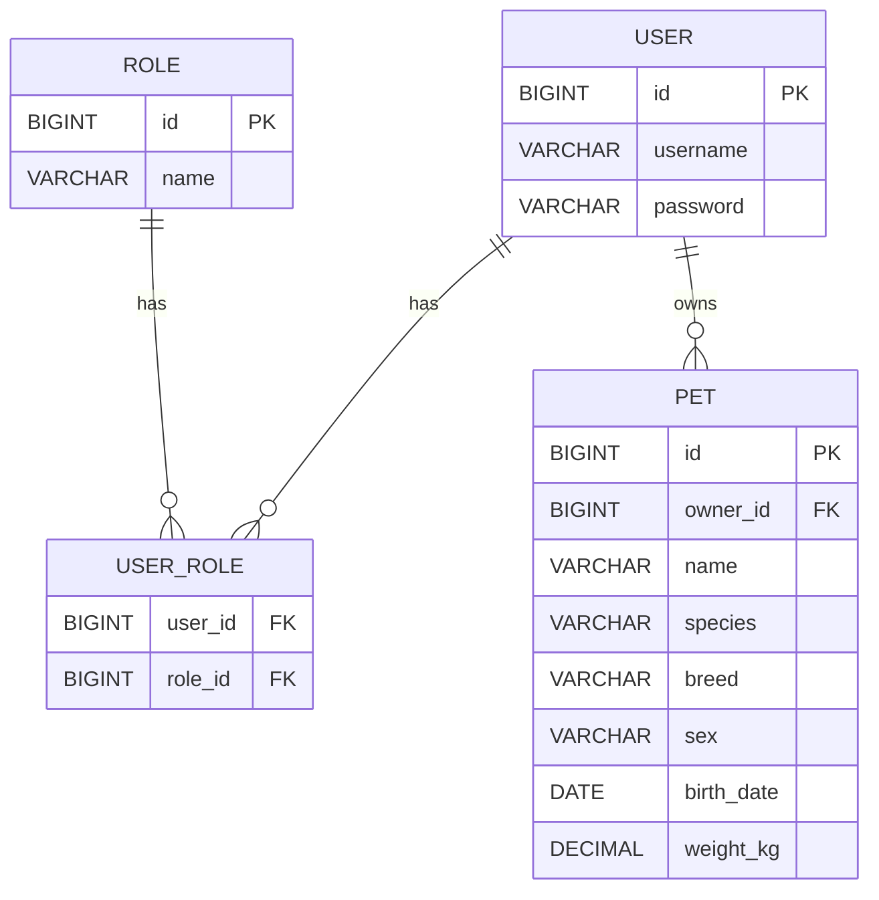
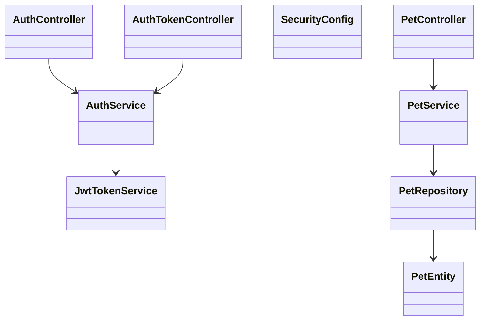
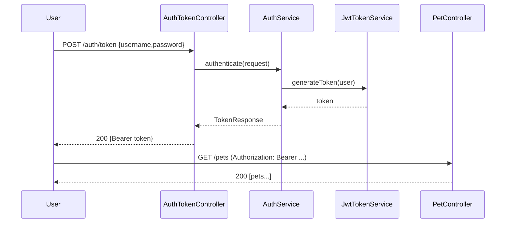

# 🐾 FitPet — Backend (Spring Boot 3 + JWT + MySQL)

API REST para autenticación con **JWT** y **gestión de mascotas** (CRUD) con **propiedad por usuario**. Base de datos **MySQL** en **Docker Compose**. Seguridad **stateless** con Spring Security. Perfiles `mysql` (principal) y `h2` (desarrollo local).

Puedes acceder al Frontend en 👉 https://github.com/Marisol-Mancera/fitpet-frontend

---

## 🎯 Alcance 

Incluye:
- **Auth**: `POST /api/v1/auth/registro`, `POST /api/v1/auth/token` (JWT HS512).
- **Pets (protegido)**: `POST /api/v1/pets`, `GET /api/v1/pets`, `GET /api/v1/pets/{id}`, `PUT /api/v1/pets/{id}`, `DELETE /api/v1/pets/{id}`.
- **Problem Object** homogéneo: `{ "code": "...", "message": "..." }` para 400/401/404/409.

Fuera de PMV (planificado): CORS fino, paginación, badges/goals, Flyway, swagger público en despliegue.

---

## 🧾 Documentación de API (Postman)

La API ha sido documentada y validada completamente en Postman.  
Puedes acceder a la colección oficial del proyecto en el siguiente enlace:

👉 [Colección Postman – FitPet API](https://postman.co/workspace/Formacion-f5~8ec198c2-5483-418c-bf18-396c04843022/collection/45994336-9fd428ee-48f0-4f43-b01e-44bce220750f?action=share&creator=45994336&active-environment=45994336-0bb997da-ee0a-45a9-bae4-5ed4452686fc)

Esta colección incluye ejemplos listos para ejecutar de:
- Registro y autenticación JWT.
- CRUD completo de mascotas (con token dinámico).
- Validaciones y respuestas de error (Problem Object).

---

## 🧠 Arquitectura

Capas: Controller → Service → Repository → DB, con DTOs para entrada/salida, mapeadores simples y handler global de errores.

**Diagrama de componentes:**


---

## 🔐 Seguridad (JWT)

- **Público**: `/api/v1/auth/**`
- **Protegido**: resto de rutas (por ejemplo, `/api/v1/pets/**`)
- Cabecera: `Authorization: Bearer <token>`
- Si recibes **401** en rutas protegidas, genera un nuevo token mediante `POST /api/v1/auth/token` (expiración configurable).

---

## ⚙️ Requisitos y configuración

**Requisitos:**
- Java 21, Maven 3.9+
- Docker + Docker Compose
- Postman/HTTP client (opcional para pruebas manuales)

**Perfiles y properties:**
- `application.properties`
  ```properties
  spring.profiles.active=mysql
  api-endpoint=api
  spring.application.name=fitpet
  ```
- `application-mysql.properties`
  ```properties
  spring.datasource.url=jdbc:mysql://mysql:3306/fitpet_db?createDatabaseIfNotExist=true&useSSL=false&allowPublicKeyRetrieval=true&serverTimezone=Europe/Madrid&characterEncoding=UTF-8
  spring.datasource.username=fitpet_user
  spring.datasource.password=fitpet_pass_2024
  spring.datasource.driver-class-name=com.mysql.cj.jdbc.Driver

  spring.jpa.hibernate.ddl-auto=update
  spring.jpa.show-sql=true
  spring.jpa.properties.hibernate.format_sql=true

  # opcional
  spring.sql.init.mode=always
  spring.jpa.defer-datasource-initialization=true
  ```
- `application-h2.properties` (desarrollo local sin Docker)
  ```properties
  spring.datasource.url=jdbc:h2:mem:testdb;MODE=MySQL;DB_CLOSE_DELAY=-1;DB_CLOSE_ON_EXIT=FALSE
  spring.datasource.driver-class-name=org.h2.Driver
  spring.datasource.username=sa
  spring.datasource.password=
  spring.h2.console.enabled=true
  spring.jpa.hibernate.ddl-auto=create-drop
  spring.jpa.show-sql=true
  spring.jpa.properties.hibernate.format_sql=true
  ```

**JWT (HS512)**
```properties
# ejemplo de claves JWT
jwt.issuer=fitpet
jwt.secret=<TU_CLAVE_BASE64_SEGURA_DE_32_BYTES_O_MAS>
jwt.expiration-seconds=3600
```

> **Nota:** El host JDBC es `mysql` (nombre del servicio en Docker), **no** `localhost`.

---

---

## 🛠 Tecnologías


---

## 🚀 Puesta en marcha

### Opción A — Docker Compose (recomendada)
```bash
docker compose up --build
# backend: http://localhost:8080
# mysql:   localhost:3307 (mapea 3306 interno)
```

### Opción B — Local (sin Docker, con H2)
```bash
mvn clean spring-boot:run -Dspring-boot.run.profiles=h2
```

---

## 📚 API (resumen y ejemplos)

### Autenticación
- **Registro** — `POST /api/v1/auth/registro` → `201 Created`
  ```json
  {
    "email": "test@fitpet.app",
    "password": "ValidPass1!"
  }
  ```

- **Token (login)** — `POST /api/v1/auth/token` → `200 OK`
  ```json
  {
    "username": "test@fitpet.app",
    "password": "ValidPass1!"
  }
  ```
  **Respuesta:**
  ```json
  {
    "tokenType": "Bearer",
    "accessToken": "eyJhbGciOiJIUzUxMiJ9...",
    "expiresIn": 3600
  }
  ```

### Mascotas (requiere Bearer)
- **Crear** — `POST /api/v1/pets` → `201 Created` + `Location: /api/v1/pets/{id}` (absoluta)
- **Listar** — `GET /api/v1/pets` → `200 OK`
- **Detalle** — `GET /api/v1/pets/{id}` → `200 OK` / `404 NOT_FOUND`
- **Actualizar** — `PUT /api/v1/pets/{id}` → `200 OK` / `404 NOT_FOUND`
- **Eliminar** — `DELETE /api/v1/pets/{id}` → `204 No Content` / `404 NOT_FOUND`

**Error estándar (Problem Object):**
```json
{ "code": "BAD_REQUEST|UNAUTHORIZED|NOT_FOUND|CONFLICT", "message": "..." }
```

---

## 🧪 Testing

Ejecutar pruebas y cobertura:
```bash
mvn clean verify
# reporte Jacoco: target/site/jacoco/index.html
```
- Auth (registro/login) con MockMvc y `Problem Object` verificado.
- Pets (CRUD) con ownership por `owner.username`, >90% cobertura en el módulo Pet.


---


## 🗂 Estructura de paquetes

```
com.fitpet
 ├─ auth/            (AuthController, AuthTokenController, dto, service)
 ├─ security/        (SecurityConfig, JwtConfig, JwtTokenService, filters*)
 ├─ user/            (UserEntity, RoleEntity, repos)
 ├─ pet/             (PetEntity, PetRepository, PetService, PetController, dto, mapper)
 ├─ exception/       (GlobalExceptionHandler, excepciones)
 └─ FitpetApplication.java
```

---

## 🗺️ Diagramas

### 1) ER 



### 2) Clases (alto nivel)



### 3) Secuencia — Login y uso de Pets



## 🧯 Troubleshooting 

- **`Host '172.18.0.1' is not allowed to connect`** → recrear volumen y usuario (alinear `compose.yaml` y `application-mysql.properties`).
- **`./docker/mysql/init.sql` faltante** → quitar referencia del compose.
- **Puerto `8080` ocupado** → liberar proceso en host.
- **`401` en `/registro`** → abrir `/api/v1/auth/**` en `SecurityConfig`:
  ```java
  .requestMatchers(HttpMethod.POST, "/api/v1/auth/**").permitAll()
  ```
- **`Content-Type 'text/plain'`** → enviar `application/json` en Postman.
- **`400 Bad Request`** → el body debe **coincidir** con el DTO (formatos fecha `YYYY-MM-DD`, etc.).

---

## 📦 Comandos útiles

```bash
# Docker
docker compose up --build
docker compose down
docker compose logs backend
docker compose logs mysql
docker compose exec mysql mysql -ufitpet_user -pfitpet_pass_2024 -e "SHOW DATABASES;"
docker compose exec mysql mysql -uroot -proot -e "USE fitpet_db; SHOW TABLES;"


## 📜 Convenciones

- **Código:** `camelCase` · **Clases:** `PascalCase` · **Tests (métodos):** `snake_case`
- **Principios:** **DRY**, **KISS**, **SOLID**
- **Commits:** **Conventional Commits** (`feat:`, `fix:`, `test:`, `refactor:`, `chore:`, `docs:`)

---

## 📓 Anexos útiles

**DTOs principales (contratos):**
- `RegisterRequest { email, password }`
- `LoginRequest { username(email), password }`
- `TokenResponse { tokenType, accessToken, expiresIn }`

**Respuestas de ejemplo:**
- `GET /api/v1/pets` → `200 OK`
  ```json
  [
    {
      "id": 12,
      "ownerId": 5,
      "name": "Pony",
      "species": "Dog",
      "breed": "Beagle",
      "sex": "Female",
      "birthDate": "2022-04-15",
      "weightKg": 12.4
    }
  ]
  ```
- `GET /api/v1/pets/999999` → `404 NOT_FOUND`
  ```json
  { "code": "NOT_FOUND", "message": "Pet not found" }
  ```
- `POST /api/v1/pets` (body inválido) → `400 BAD_REQUEST`
  ```json
  { "code": "BAD_REQUEST", "message": "name must not be blank" }
  ```

---

**Autoría:** Marisol Mancera — FitPet Backend  
**Licencia/Disclaimer:** Proyecto académico, uso educativo, sin garantías.
